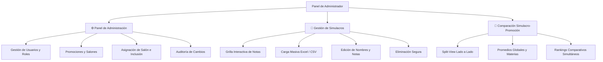

# 📊 Dashboard de Simulacros PreIcfes AGS

Sistema integral de analítica educativa, seguimiento pedagógico y pronóstico predictivo con Machine Learning para el examen de estado **ICFES Saber 11** en el colegio Saucará (Aspaen).

---

## 🧭 Guía de Secciones del Dashboard

La plataforma cuenta con módulos de visualización accesibles para el cuerpo docente y directivo según su rol:

### 1. 🏠 Inicio
- **Panorama Institucional:** Muestra los indicadores clave de la promoción activa (estudiantes matriculados, número de simulacros aplicados y total de registros).
- **Métricas del Último Simulacro:** Resumen de promedios globales y por asignatura.
- **Alertas y Fortalezas Pedagógicas:** Identificación automática de materias críticas y de alto rendimiento.
- **Recomendaciones Didácticas:** Sugerencias estratégicas a corto, mediano y largo plazo generadas para el simulacro seleccionado.

### 2. 🏆 Top Global (Rankings)
- **Podio de Excelencia:** Reconocimiento visual a los estudiantes con mejores promedios generales acumulados (medallas 🥇, 🥈, 🥉 y tarjetas de honor).
- **Tabla Dinámica Filtrable:** Listado completo ordenable por puntaje general o por cualquier asignatura individual (`Lectura Crítica`, `Matemáticas`, `Sociales`, `Ciencias`, `Inglés`).
- **Filtros por Salón y Rango:** Permite segmentar por salones (`11`, `11A`, `11B`) o rangos de puntaje (ej: 300 a 500).
- **Gráficas de Top 30 y Distribución:** Histogramas de frecuencia y diagramas de caja (*Boxplots*) para evaluar la dispersión de la cohorte.
- **Descargas Oficiales:** Botones para exportar la tabla filtrada o el consolidado histórico completo a archivos Excel formateados.

### 3. 📋 Reporte General
- **Radiografía del Simulacro:** Vista detallada de las notas del simulacro seleccionado en la barra lateral.
- **Estadísticas de Cohorte:** Promedio, mediana, desviación estándar y notas máxima/mínima por materia.
- **Filtros de Búsqueda:** Búsqueda rápida por nombre de estudiante con semaforización de notas en verde, amarillo y rojo.

### 4. 🔬 Comparación entre Simulacros
- **Evolución Longitudinal:** Gráfico comparativo de barras agrupadas que contrasta los promedios de todas las asignaturas a través de diferentes simulacros.
- **Diferenciales de Rendimiento ($\Delta$):** Cuantifica las ganancias o pérdidas de puntaje entre una prueba y otra para medir el impacto de los refuerzos académicos.

### 5. 👤 Análisis Individual por Estudiante
- **Ficha Integral del Estudiante:** Selección individual de cualquier alumno para consultar su historial completo.
- **Gráfica de Progresión Temporal:** Trayectoria cronológica de todos los simulacros presentados con trazado de tendencia.
- **🔮 Proyección ICFES (Modelo Predictivo):** Pronóstico numérico del Puntaje Global (0-500) y de cada una de las 5 materias (0-100) con intervalo de confianza adaptativo.
- **Radar de Competencias:** Gráfico polar que superpone el rendimiento del estudiante, el promedio del salón y el pronóstico del modelo.
- **Tabla Detallada con Diferencias:** Comparativa numérica materia por materia.

### 6. 📈 Avance y Seguimiento
- **Evolución Estudiante por Estudiante:** Seguimiento histórico que compara la prueba diagnóstica inicial frente a la última evaluación para identificar a los alumnos con mayor crecimiento y a quienes requieren apoyo pedagógico urgente.

### 7. 📉 Estadísticas Detalladas
- **Matriz de Correlación:** Análisis estadístico para entender cómo se relacionan las materias entre sí (ej: correlación entre Matemáticas y Ciencias Naturales).
- **Desglose por Salones:** Comparación del promedio general y por asignatura entre los salones `11A` y `11B`.

### 8. 🎯 Resultados Oficiales ICFES Real
- **Contraste Oficial:** Una vez el ICFES publica los resultados reales, este módulo permite cotejar el puntaje final oficial frente al promedio de los simulacros de preparación.
- **Pestaña de Inclusión:** Vista diferenciada para estudiantes con adecuaciones curriculares o en condición de inclusión.
- **Pestaña de Calibración y Diagnóstico ML:** Auditoría de precisión del modelo predictivo para la cohorte egresada.

---

## 🔒 Módulos Exclusivos para Administradores

Los usuarios con rol `admin` tienen acceso a herramientas avanzadas para la gestión escolar y el análisis comparativo profundo:



### 1. ⚙️ Panel Global de Administración
- **🔑 Usuarios y Permisos:** Creación de nuevos usuarios, cambio seguro de contraseñas (hash PBKDF2), activación/desactivación de cuentas y asignación de roles (`admin` y `docente`).
- **🎓 Promociones y Salones:** Creación de nuevas promociones anuales (ej: 2026, 2027), configuración de salones (`11`, `11A`, `11B`) y asignación de permisos de acceso por docente.
- **👥 Estudiantes e Inclusión:** Asignación masiva de salón por estudiante y marcado del indicador de inclusión (`es_inclusion`).
- **📋 Registro de Auditoría (`auditoria_cambios`):** Historial transaccional inmutable que registra qué usuario creó, editó o eliminó simulacros, usuarios o notas con marcas de tiempo exactas.
- **🔐 Historial de Inicios de Sesión:** Registro de accesos exitosos y fallidos con purga automática optimizada a 90 días.

### 2. 📝 Captura y Gestión de Simulacros
- **Ingreso Manual por Grilla:** Tabla editable interactiva precargada con los estudiantes de la promoción activa. Permite ingresar notas de 0 a 100 por materia calculando el puntaje global ponderado automáticamente en tiempo real.
- **Carga Masiva desde Archivo (Excel / CSV):** Procesador de hojas de cálculo que ingesta notas directamente en PostgreSQL aplicando normalización de nombres y fórmulas ICFES.
- **Descarga de Plantilla Oficial:** Genera una plantilla `.xlsx` con los nombres exactos de los estudiantes registrados en la promoción activa.
- **Edición y Renombre:** Modificación ágil de nombres de simulacro y corrección de notas por estudiante.
- **Eliminación Segura:** Borrado definitivo en cascada con confirmación obligatoria.

### 3. 🔄 Comparación Simulacro-Promoción (*Split-View*)
- **Vista Dividida en 2 Columnas:** Permite seleccionar independientemente **Promoción A + Simulacro A** vs. **Promoción B + Simulacro B** (incluso de años lectivos distintos).
- **Tarjetas Métricas Comparativas Fluidas:** Compara el promedio general y las 5 asignaturas lado a lado con indicadores visuales de diferencia ($\Delta$).
- **Gráficos de Barras Comparativos:** Visualización de las 5 dimensiones académicas en paralelo.
- **Rankings Simultáneos:** Tablas de posiciones de ambos simulacros una al lado de la otra para contrastar el rendimiento relativo de los estudiantes.

---

## 🤖 El Modelo Predictivo de Machine Learning

### ¿Qué hace el modelo?
El modelo estima cuál será el **Puntaje Global oficial (escala 0-500)** y el **puntaje en cada una de las 5 materias (escala 0-100)** que obtendrá un estudiante en el examen real de Estado ICFES Saber 11, antes de que lo presente.

```text
[Simulacro 1] ──> [Simulacro 2] ──> [Simulacro 3] ──> ... ──> [🔮 PREDICCIÓN FINAL]
     310 pts            325 pts            338 pts           345 pts [332 - 358]
                                                             ├─ Lectura: 72 pts
                                                             ├─ Matemáticas: 74 pts
                                                             ├─ Sociales: 68 pts
                                                             ├─ Ciencias: 66 pts
                                                             └─ Inglés: 78 pts
```

### ¿Cómo aprende y cómo funciona?

1. **Aprende de la experiencia histórica:**  
   El modelo analiza los datos de estudiantes de promociones pasadas que ya completaron todo su ciclo de simulacros y presentaron el examen ICFES real. Aprende cómo la evolución en los simulacros se traduce finalmente en el puntaje oficial.

2. **Analiza 16 variables de aprendizaje (no solo una nota):**  
   En lugar de mirar únicamente la última nota, el modelo analiza:
   - **El punto de partida:** Cuánto sacó el estudiante en su primer simulacro diagnóstico.
   - **El rendimiento reciente:** Le da más peso a los simulacros recientes usando decaimiento exponencial.
   - **La tendencia de mejora (pendiente):** Si las notas del estudiante van subiendo, estancadas o bajando.
   - **La constancia (volatilidad):** Si el estudiante mantiene notas estables o tiene variaciones muy fuertes.
   - **El equilibrio entre asignaturas:** Evalúa si el estudiante tiene un perfil balanceado o si destaca en ciencias vs. letras.
   - **El promedio específico en cada materia:** Cuánto promedia en Lectura, Matemáticas, Sociales, Ciencias e Inglés.

3. **Predicción Jerárquica y Coherente:**  
   - Proyecta individualmente cada una de las 5 asignaturas de 0 a 100.
   - Proyecta el puntaje global de 0 a 500.
   - Reconcilia ambas estimaciones usando la **fórmula oficial de ponderación del ICFES** (Lectura $\times 3$, Matemáticas $\times 3$, Sociales $\times 3$, Ciencias $\times 3$, Inglés $\times 1$), garantizando que la suma de las partes coincida con el total global.

4. **Rango de Confianza Adaptativo:**  
   - Si un estudiante solo ha presentado 1 o 2 simulacros, el modelo entrega un rango más amplio (ej: $[315 - 355\text{ pts}]$) y advierte que la confiabilidad es moderada.
   - A medida que el estudiante presenta su 3°, 4°, 5° simulacro, el margen de incertidumbre **se reduce automáticamente** (ej: $[334 - 352\text{ pts}]$).

5. **Protección Total contra Trampas (*Zero Data Leakage*):**  
   Cuando el modelo genera la predicción para un estudiante activo, **tiene prohibido mirar o consultar resultados del ICFES real**. Solo lee su historial de simulacros.

6. **Autorrefinamiento Continuo (*Fine-Tuning Loop*):**  
   El sistema no tiene fórmulas fijas ni códigos quemados. Cada vez que una nueva promoción entrega sus resultados oficiales del ICFES o se suben nuevos simulacros, el sistema **se auto-entrena en caliente**, ajusta los sesgos y se vuelve más preciso de forma automática.

### Precisión del Modelo (Validación Cruzada LOOCV):
- **Error Promedio (MAE):** Menor a **$6.9$ puntos** en escala de 0 a 500.
- **Sesgo Sistemático:** $+0.03$ puntos *(prácticamente cero desviación hacia arriba o abajo)*.
- **Efectividad:** Más del **$86\%$** de los estudiantes caen dentro de $\pm 15$ puntos del resultado real y el **$96.7\%$** dentro de $\pm 20$ puntos.

---

## 🛠️ Requisitos y Puesta en Marcha

### 1. Instalación de Dependencias
```bash
pip install -r requirements.txt
```

### 2. Configuración de Variables de Entorno (`.env`)
Crea un archivo `.env` en la raíz del proyecto con la URL de conexión a PostgreSQL en Supabase:
```env
SUPABASE_DB_URL=postgresql://postgres:[PASSWORD]@[HOST]:5432/postgres
```

### 3. Ejecución Local
```bash
streamlit run app.py
```

---

## 🏛️ Estructura del Código

```text
├── app.py                                # Punto de entrada principal y enrutador de navegación
├── simulacros_ags/
│   ├── auth.py                           # Autenticación, roles y verificación segura PBKDF2
│   ├── config.py                         # Constantes institucionales y materias ICFES
│   ├── core_utils.py                     # Conexión centralizada a BD, fórmulas ICFES y sanitización
│   ├── data.py                           # Consultas, persistencia e ingestión de simulacros
│   ├── promociones.py                    # Gestión de promociones, salones y accesos docentes
│   ├── styles.py                         # Hojas de estilo CSS y diseño responsivo
│   ├── ml/
│   │   ├── prediccion_icfes.py           # Pipeline dual de Machine Learning (Materias + Global)
│   │   └── artifacts/                    # Modelos entrenados serializados y metadatos JSON
│   └── pages/
│       ├── inicio.py                     # Dashboard principal y KPIs
│       ├── rankings.py                   # Top global y tabla general
│       ├── reporte_general.py            # Reporte por simulacro
│       ├── comparacion.py                # Comparación longitudinal interna
│       ├── analisis_individual.py        # Ficha por estudiante con ML y radar
│       ├── avance.py                     # Seguimiento inicial vs final
│       ├── estadisticas_detalladas.py    # Correlaciones y salones
│       ├── resultados_reales.py          # Comparativa ICFES Real y calibración ML
│       ├── comparacion_simulacro_promocion.py  # [Admin] Split-View comparativo
│       ├── admin.py                      # [Admin] Panel global de administración
│       └── gestion.py                    # [Admin] Captura, edición y eliminación
├── supabase/
│   └── schema.sql                        # DDL de tablas e índices en PostgreSQL
└── tests/
    ├── test_core_utils.py                # Pruebas unitarias de utilidades y fórmulas ICFES
    └── test_prediccion.py                # Pruebas del pipeline de Machine Learning adaptativo
```
